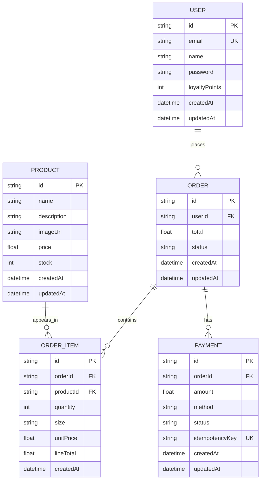

# BrewLite Data Objects

This document describes the complete domain model for the BrewLite e-commerce project.

## Data model overview



## 1. User
Represents a registered customer.

Fields:
- `id`: unique identifier
- `email`: unique email address
- `name`: optional full name
- `password`: account password/hash
- `loyaltyPoints`: points earned by the user for purchases or promotions
- `createdAt`: account creation date
- `updatedAt`: last modification time

Relationships:
- One user can place many orders.

## 2. Product
Represents an item sold in the store.

Fields:
- `id`: unique identifier
- `name`: product name
- `description`: description of the product
- `imageUrl`: image path/URL for product display
- `price`: selling price
- `stock`: available quantity in inventory
- `createdAt`: creation timestamp
- `updatedAt`: last update timestamp

Relationships:
- A product may appear in many order items.

## 3. Order
Represents a purchase placed by a user.

Fields:
- `id`: unique identifier
- `userId`: buyer reference
- `total`: total order amount
- `status`: order lifecycle status
- `createdAt`: order creation time
- `updatedAt`: last status or update change

Typical statuses:
- `PENDING`
- `PAID`
- `SHIPPED`
- `CANCELLED`

Relationships:
- One user can have many orders.
- One order can have many order items.
- One order can have many payments.

## 4. OrderItem
Represents a single product entry inside an order.

Fields:
- `id`: unique identifier
- `orderId`: parent order
- `productId`: product being purchased
- `quantity`: number of units
- `size`: optional variant/size such as S, M, L, 500ml, etc.
- `unitPrice`: product price at purchase time
- `lineTotal`: quantity × unitPrice
- `createdAt`: line item creation timestamp

Relationships:
- Many order items belong to one order.
- Each order item refers to one product.

## 5. Payment
Represents payment processing for an order.

Fields:
- `id`: unique identifier
- `orderId`: order being paid
- `amount`: payment amount
- `method`: payment method, such as COD, card, wallet, bank transfer
- `status`: payment result
- `idempotencyKey`: unique key used to safely prevent duplicate payment processing
- `createdAt`: payment date
- `updatedAt`: last payment update

Typical statuses:
- `PENDING`
- `SUCCESS`
- `FAILED`
- `REFUNDED`

## Notes on business logic

The complete schema should support these operations:
- User registers and earns loyalty points.
- Product has price, image, and inventory stock.
- Customer adds product variants to cart or order.
- Order item stores quantity, size, unit price, and line total.
- Payment uses idempotency protection to avoid duplicate charge submission.

## Recommended final schema summary

```prisma
model User {
  id            String   @id @default(cuid())
  email         String   @unique
  name          String?
  password      String?
  loyaltyPoints Int      @default(0)
  orders        Order[]
  createdAt     DateTime @default(now())
  updatedAt     DateTime @updatedAt
}

model Product {
  id          String      @id @default(cuid())
  name        String
  description String?
  imageUrl    String?
  price       Float
  stock       Int         @default(0)
  orderItems  OrderItem[]
  createdAt   DateTime    @default(now())
  updatedAt   DateTime    @updatedAt
}

model Order {
  id        String      @id @default(cuid())
  user      User        @relation(fields: [userId], references: [id])
  userId    String
  items     OrderItem[]
  payments  Payment[]
  total     Float
  status    String      @default("PENDING")
  createdAt DateTime    @default(now())
  updatedAt DateTime    @updatedAt
}

model OrderItem {
  id        String   @id @default(cuid())
  order     Order    @relation(fields: [orderId], references: [id])
  orderId   String
  product   Product  @relation(fields: [productId], references: [id])
  productId String
  quantity  Int
  size      String?
  unitPrice Float
  lineTotal Float
  createdAt DateTime @default(now())
}

model Payment {
  id             String   @id @default(cuid())
  order          Order?   @relation(fields: [orderId], references: [id])
  orderId        String?
  amount         Float
  method         String
  status         String   @default("PENDING")
  idempotencyKey String?  @unique
  createdAt      DateTime @default(now())
  updatedAt      DateTime @updatedAt
}
