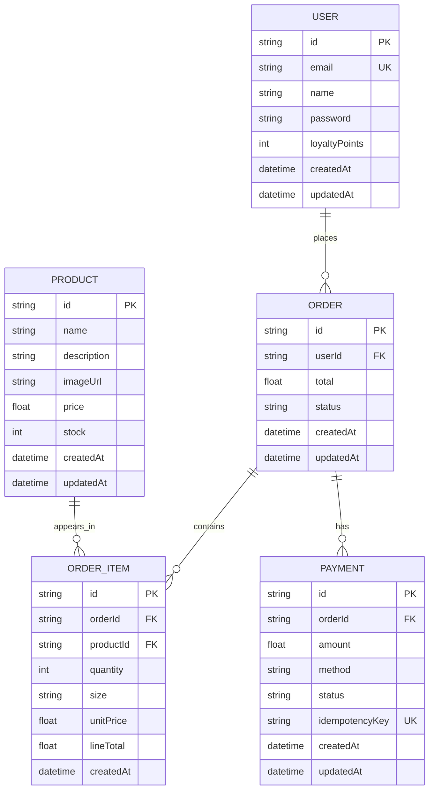

# BrewLite Database Design

This document describes the complete database design for BrewLite as an e-commerce system.

## Entity Relationship Diagram



## Table Definitions

### User
- `id`: String, primary key
- `email`: String, unique
- `name`: String, nullable
- `password`: String, nullable
- `loyaltyPoints`: Int, default 0
- `createdAt`: DateTime, default now()
- `updatedAt`: DateTime, auto update

### Product
- `id`: String, primary key
- `name`: String
- `description`: String, nullable
- `imageUrl`: String, nullable
- `price`: Float
- `stock`: Int, default 0
- `createdAt`: DateTime, default now()
- `updatedAt`: DateTime, auto update

### Order
- `id`: String, primary key
- `userId`: String, foreign key to `User.id`
- `total`: Float
- `status`: String, default `PENDING`
- `createdAt`: DateTime, default now()
- `updatedAt`: DateTime, auto update

### OrderItem
- `id`: String, primary key
- `orderId`: String, foreign key to `Order.id`
- `productId`: String, foreign key to `Product.id`
- `quantity`: Int
- `size`: String, nullable
- `unitPrice`: Float
- `lineTotal`: Float
- `createdAt`: DateTime, default now()

### Payment
- `id`: String, primary key
- `orderId`: String, foreign key to `Order.id`, nullable
- `amount`: Float
- `method`: String
- `status`: String, default `PENDING`
- `idempotencyKey`: String, unique, nullable
- `createdAt`: DateTime, default now()
- `updatedAt`: DateTime, auto update

## Business Rules

1. A user can place many orders.
2. Each order belongs to exactly one user.
3. An order can contain multiple order items.
4. Each order item belongs to one order and one product.
5. A product can appear in many order items.
6. Each payment belongs to an order.
7. `idempotencyKey` prevents duplicate payment processing.
8. `lineTotal = quantity * unitPrice`.
9. `stock` should be checked before finalizing an order.
10. `loyaltyPoints` can be used for discount or reward logic.

## Prisma Schema

```prisma
generator client {
  provider = "prisma-client-js"
}

datasource db {
  provider = "postgresql"
  url      = env("DATABASE_URL")
}

model User {
  id            String   @id @default(cuid())
  email         String   @unique
  name          String?
  password      String?
  loyaltyPoints Int      @default(0)
  orders        Order[]
  createdAt     DateTime @default(now())
  updatedAt     DateTime @updatedAt
}

model Product {
  id          String      @id @default(cuid())
  name        String
  description String?
  imageUrl    String?
  price       Float
  stock       Int         @default(0)
  orderItems  OrderItem[]
  createdAt   DateTime    @default(now())
  updatedAt   DateTime    @updatedAt
}

model Order {
  id        String      @id @default(cuid())
  user      User        @relation(fields: [userId], references: [id])
  userId    String
  items     OrderItem[]
  payments  Payment[]
  total     Float
  status    String      @default("PENDING")
  createdAt DateTime    @default(now())
  updatedAt DateTime    @updatedAt
}

model OrderItem {
  id        String   @id @default(cuid())
  order     Order    @relation(fields: [orderId], references: [id])
  orderId   String
  product   Product  @relation(fields: [productId], references: [id])
  productId String
  quantity  Int
  size      String?
  unitPrice Float
  lineTotal Float
  createdAt DateTime @default(now())
}

model Payment {
  id             String   @id @default(cuid())
  order          Order?   @relation(fields: [orderId], references: [id])
  orderId        String?
  amount         Float
  method         String
  status         String   @default("PENDING")
  idempotencyKey String?  @unique
  createdAt      DateTime @default(now())
  updatedAt      DateTime @updatedAt
}
```

## Summary
This is the complete database design for BrewLite: user, product, order, order item, and payment, with all missing key fields required for a realistic e-commerce flow.
